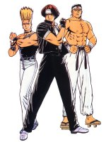
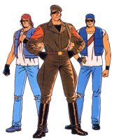

## Historia Previa



En 1991, **SNK** lanza "[Fatal Fury: King of Fighters](http://en.wikipedia.org/wiki/Fatal_Fury)" para su mítica placa **MVS**, conocida como **Neo Geo** en el mercado doméstico. El argumento giraba en torno a Terry Bogard, que de niño presencia la muerte de su padrastro y mentor Jeff Bogard a manos del criminal Geese Howard. Terry sigue el consejo del maestro de su Jeff, Tung Fu Rue, y después de un duro entrenamiento en su ciudad natal de _SouthTown_, decide vengarse de ese asesinato.

Varios años después, Geesee se establece como el hombre más poderoso de _SouthTown_, y decide organizar un torneo de lucha en la ciudad para entretenerse y medir la fuerza de sus rivales. El campeón tendría el derecho de enfrentarse con Geesee, aunque nunca nadie llega a la final, ya que su lacayo Billy Kane --un inglés muy hábil con una vara extensible--, derrotaba previamente a los que lo intentaban.

En el torneo "_The King of Fighters_" de 1991, Terry se une a su hermano Andy y al luchador de Muay Thai Joe Higashi para ganarlo. Al final Terry consigue llegar a la final y derrota a Geese, y parece morir al caer del último piso de su rascacielos...

En 1992 sale la continuación: "_Fatal Fury 2_". Esta vez es el hermanastro de Geese, Wolfgang Krauser, el que organiza un nuevo torneo. La novedad es que ahora tiene alcance mundial, y los contrincantes son mucho más poderosos.

Los Lobos Solitarios (_Garou Densetsu_): Terry, Andy y Joe, vuelven a participar, y como era de esperar, Terry finalmente derrota a Wolfgang Krauser.

Al año siguiente, se organiza en Japón un torneo llamado _Zen Nihon Ishu Kakutougi Taiki_, en el que sale como vencedor Kyo Kusanagi, el último heredero de un clan de casi dos mil años de antiguedad, poseedores de una técnica que había sellado en el pasado a la entidad [Yamata no Orochi](http://en.wikipedia.org/wiki/Orochi). En la final derrotó a Benimaru Nikaido, un luchador arrogante con un peculiar estilo de lucha, y en la semifinal se topó con Goro Daimon, un fornido experto en Judo.

Estos tres luchadores, junto con el equipo del Lobo Solitario, y otros personajes de probada fuerza y coraje, reciben en 1994 una invitación para un nuevo torneo "_King of Fighters_", dentro de un sobre blanco y selladas con la inicial "R".



Rugal Bernstein, un traficante de drogas y armas, es el que había encargado a su secretaria personal Mature entregar dichas invitaciones, para derrotar a los luchadores más fuertes del mundo. Esta vez las normas obligaban a hacer grupos de tres luchadores, que representan a ocho paises distintos. Sin embargo, antes de que se iniciase el torneo, un nuevo luchador se enfrentó a Rugal para frenar su ambición. Sin embargo, éste último no se sintió intimidado...



## Desarrollo

De esta manera, se introduce un nuevo concepto en los juegos de lucha: el juego por equipos. Una vez escogido, se debe escoger el orden de participación, lo que añade un toque de estrategia a este género. Se echa en falta poder personalizarlos, pero eso ya será posible en los juegos posteriores.

Para completar la plantilla de personajes, se recurre a otras sagas de lucha de **SNK**: "_Fatal Fury_" y "_Art of Fighting_", así como a clásicos de la compañía, como "[Pyscho Soldier](http://en.wikipedia.org/wiki/Psycho_Soldier)" o "[Ikari Warriors](http://en.wikipedia.org/wiki/Ikari_Warriors)". Además, se introducen otros nuevos que serán fundamentales en la trama del juego, como el nuevo protagonista de la saga: Kyo Kusanagi.

| **Italia** (Fatal Fury Team) | **China** (Psycho Soldier Team) |
| --- | --- |
|  |  |
| Andy Bogard | Chin Gensai |
| Terry Bogard | Athena Asamiya |
| Joe Higashi | Sie Kensou |
|  |  |

| **Japón** (Hero Team) | **EEUU** (American Sports Team) |
| --- | --- |
|  |  |
| Benimaru Nikaido | Lucky Glauber |
| Kyo Kusanagi | Heavy D! |
| Goro Daimon | Brian Battler |
|  |  |

| **Corea** (Kim Team) | **Brasil** (Ikari Team) |
| --- | --- |
|  |  |
| Chang Koehan | Ralf Jones |
| Kim Kaphwan | Heidern |
| Choi Bunge | Clark Steel| 
| |  |

| **Inglaterra** (Women Team) | **México** (Art of Fighting Team) |
| --- | --- |
|  |  |
| Mai Shiranui | Robert García |
| King | Takuma Sakazaki |
| Yuri Sakazaki | Ryo Sakazaki |
|  |  |

El sistema de juego se basa en el de otros juegos de la compañía, ya que disponemos de unos ataques llamados _Desperation Moves_ que podemos realizar cuando tenemos la energía casi nula o la barra de POW llena. Esta barra se va llenando al recibir o al cubrirse de los golpes, y hace que podamos inflingir el doble de daño cuando está repleta. También puede llenarse manualmente si pulsamos simultáneamente los botones A, B y C.

Por otra parte, podemos esquivar pulsando A y B a la vez, y si usamos C y D, daremos un golpe al rival que lo mandará al suelo.



## Apartado Técnico

Aunque pueda parecer algo desfasado hoy en día, no se puede negar que la calidad de los diseños y las músicas es excepcional. Tanto es así, que en sucesivas entregas se cambió sobre todo la jugabilidad y la calidad de las animaciones, pero las conceptos artísticos y musicales fueron la base de los juegos posteriores.







Sólo hay que ver algunos escenarios para asombrarnos por la cantidad de detalles que se pueden ver en ellos:







Como venía siendo costumbre en **SNK**, también se lanzaron dos CDs, uno con la banda sonora original y otro con la versión "_arrange_":





## Versiones

Hasta hace muy poco, este "_King of Fighters_" ha sido exclusivo de **Neo Geo** y **Neo Geo CD**. Sin embargo, en 2004 y con motivo del décimo aniversario de la saga, salió en Japón un remake de este juego para **PlayStation 2** llamado "_King of Fighters '94 Re-Bout_", con gráficos en alta resolución, escenarios en tres dimensiones, juego on-line y otras características extra, como una nueva intro y el juego original de **Neo Geo**.

## Desenlace

El equipo de Japón va ganando puestos, y eventualmente derrotan al equipo de Heidern. De esta manera, los militares pasan a espiar desde dentro todo lo que sucede en el sospechoso torneo.

Al ganar la final, el trío de héroes son conducidos por Mature hasta el portaviones de Rugal --el Blacknoah-- en helicóptero, en teoría para recibir el premio. Sin embargo, Kyo se encuentra con su padre Saisyu a punto de morir, que se había enfrentado previamente a Rugal. Al parecer éste último tenía relación con el clan enemigo de los Kusanagi, y Saisyu advierte a Kyo del peligro que corren frente al magnate.



Rugal desvela sus auténticas intenciones, ya que los luchadores a los que derrota se convierten en piedra, y de esta manera sustrae sus técnicas. Los japoneses no se rinden y se enfrentan a él, y al principio lucha descuidadamente y recibe una paliza, pero después se pone serio y derrota con facilidad a Benimaru y Daimon. Posteriormente, Kyo y Rugal se baten en una lucha encarnizada, y en el último momento, Kyo es capaz de vencer a Rugal con su torbellino de fuego.

El traficante, agonizando, activa un dispositivo de autodestrucción del barco, y el equipo de héroes consiguen escapar a tiempo, sin ningún premio entre manos salvo el hecho de ser los campeones del torneo.



Heidern y los suyos observan desde lejos la explosión y creen haberse deshecho de esta manera del traficante, aunque poco después se verá que esto no es del todo cierto...



Más información:

*   [Review en NGFL](http://www.neogeoforlife.com/neo_reviews/the_king_of_fighters_94.php)
*   [Review en HG101](http://www.hardcoregaming101.net//kof/kof2.htm)
*   [CyberFanatix](http://www.cyberfanatix.com/)
*   [Galactica Phantom](http://kof.confusticated.com/frames.html)
*   [King of Fighters 10th Anniversary](http://www.kof10th.com/english/index.html)

Comprar:

*   [King of Fighters '94 (Neo Geo)](http://www.play-asia.com/SOap-23-83-rmr-71-3p-77-1c-49-en-15-king+of+fighters-84-j-70-l9y.html)
*   [King of Fighters '94 (Neo Geo CD)](http://www.play-asia.com/SOap-23-83-rmr-71-8v-77-d-49-en-15-king+of+fighters-84-j-70-omy.html)
*   [King of Fighters '94 Re-Bout (PS2)](http://www.play-asia.com/SOap-23-83-rmr-71-40-77-5-49-en-15-king+of+fighters-84-j-70-ckd.html)