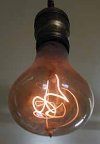

Vía [Microsiervos](http://www.microsiervos.com/) llego a [una página](http://www.centennialbulb.org/) en la que se muestra la bombilla que más tiempo ha estado luciendo: nada más y nada menos que 105 años (dentro de poco, un millón de horas).

Es que ya no se hacen las cosas como antes...