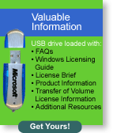

Leo en [ALT1040](http://feeds.feedburner.com/alt1040?m=2312) que los chicos de **Microsoft**, en un alarde de generosidad, [regalan llaves USB](http://www.microsoft.com//windowsxp/mysterysolved/corp/default.mspx) con publicidad. Sólo hay que tener una cuenta de Passport (vamos, un correo de hotmail de toda la vida) y darles tus datos personales... aunque puede que esto asuste a más de uno :wink:

Por cierto, hay que pulsar en el icono que sale una llave USB sobre un fondo verde, la que pongo como imagen en este post.

Como habréis deducido, las respuestas son 2, True, True, True.

**ACTUALIZADO**: Al final no mandaban [nada de nada](/el-misterio-del-usb-perdido/) :yum: