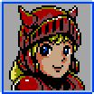
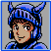

**Konami** fue uno de los grandes baluartes del **MSX**, y a lo largo de los años lanzó títulos para este ordenador que han quedado en la memoria de todos, como "_King's Valley_", la saga "_Nemesis (Gradius)_" o los primeros "_Metal Gear_", por poner algunos de los ejemplos más conocidos. Entre ellos, también se encuentra "[Knightmare](http://en.wikipedia.org/wiki/Knightmare_%28MSX%29)" ("_Majou Densetsu_"), lanzado al mercado en 1986.



La historia nos sitúa en la antigua Grecia, dónde el valiente guerrero Popolón debe rescatar a su amada Afrodita de las garras de Hudnos, el Príncipe de las Tinieblas. Para ello debe encontrar el castillo de las pesadillas, ayudándose de las joyas mágicas que Afrodita le ha dejado por el camino, y los cristales mágicos del Olimpo. Siguiendo el consejo de Hera --la hermana de Zeus--, se dirige hacia el Monte Atos tras el cual se encuentra prisionera su amada.

Tras este argumento, se esconde un _shoot'em up_ disfrazado de aventura en el que debemos destruir o esquivar enemigos que van desde murciélagos hasta fantasmas, y nos podemos ir ayudando de diversas armas además de otros poderes como invencibilidad temporal o un escudo. En algunas ocasiones debemos saber anticipadamente que obstáculos nos vamos a encontrar, ya que el hecho de adquirir ciertas habilidades puede impedirnos avanzar.



El juego fue relanzado en disco en 1988 en el pack "_Konami Game Collection 1_" junto a "_Antarctic Adventure_", "_Yie-Ar Kung Fu_", "_Yie-Ar Kung Fu 2_" y "_King's Valley_". Esta versión tenía la música mejorada si teníamos insertado un cartucho SCC+ ([Konami Sound Cartridge](http://en.wikipedia.org/wiki/Konami_Sound_Cartridge)).

En 2003 **Konami** lo reprogramó para los móviles japoneses, dejando gratuitamente la primera fase y haciendo de pago las demás.



De forma no oficial, el brasileño **Adriano Camargo Rodrigues da Cunha** y su equipo, sacaron una curiosa versión en CD destinada a ser jugada en equipos con ATA-IDE y MSX-DOS 2. La llamaron "[Kightmare Gold](http://www.caetano.eng.br/MSXPage/KMG/?p=0&l=en)" y tenía un modo en el que se mejoraban los gráficos cuando se jugaba en un **MSX2**, además de cambiar otros detalles:



Este mismo año se lanzado la edición "20º Aniversario" de "_Knightmare Gold_" con muchos fallos corregidos, en una caja de DVD y con un manual actualizado:

En 1987, Konami saca al mercado la continuación para **MSX**: "[Maze of Galious](http://en.wikipedia.org/wiki/The_Maze_of_Galious)".



Todo lo acontecido en el primer juego era una trampa de Galious --el jefe supremo de los infiernos--, para hacerse con el Reino de Grecia. Aprovechó la ausencia de Popolón para secuestrar al futuro hijo que tendría con Afrodita años más tarde, y lo retuvo en el Castillo Griego, que ahora pertenecía a Galious. Popolón y Afrodita deben luchar contra las nuevas fuerzas enemigas del Castillo para recuperar a su hijo.

Esta vez el juego se desarrolla como una aventura en perspectiva lateral, y debemos ir recorriendo las diversas partes del castillo, derrotando un monstruo en otros diez niveles que podemos acceder en ciertas zonas del mismo. Por el camino nos encontraremos con diversas armas y objetos que serán necesarios para vencer a estos monstruos, así como con unos santuarios dónde podemos comprar y vender ciertos items.



En cualquier momento podemos alternar entre Popolón y Afrodita, que tienen algunas habilidades diferentes en un principio, aunque pueden igualarse con el uso de ciertos objetos:

|  Afrodita |  Popolón |
| --- | --- |
| Puede nadar. | No puede nadar.
| Dispara tres veces a la vez, y puede poner tres minas. | Dispara dos veces a la vez, aunque destruye las rocas más rápido. |
| La altura del salto siempre es constante. | La altura del salto es variable. Puede pasar por ciertas puertas que Afrodita no puede. |

Ese mismo año, el juego fue convertido a **Famicom**, cambiando ligeramente el desarrollo:



El aspecto gráfico está mejorado, y se ha reducido el número de mundos a la mitad, aunque son bastante más amplios que en la versión de **MSX**. Además, se ha añadido scroll horizontal --previamente era pantalla a pantalla--, y eso puede desorientarnos en un principio. Por otra parte, todos los textos e items se encuentran en japonés, lo que lo hace un poco más inaccesible al público occidental, ya que sólo vió la luz en el país nipón.

**Konami** distribuyó unas tarjetas coleccionables con esta versión del juego, en las que se puede ver a los protagonistas enfrentándose a alguno de los enemigos finales del juego:







La tercera entrega de la saga se lanza en el mismo 1987 con el título de "_Shalom_" --palabra hebrea que significa "paz"--, y es quizás la más surrealista de las tres.



Somos un aficionado a los ordenadores que lleva el club de informática de nuestra escuela, y un día la chica a la que le gustamos nos enseña el cartucho de "_Shalom_", pero nos pide que no juguemos con él, ya que está maldito. Sin embargo, hacemos caso omiso a su consejo y lo introducimos en el ordenador. En ese momento, el cartucho nos absorbe y en el juego nos encontramos con una cerdita que es capaz de hablar. Con la ayuda de esta cerdita llamada Butako, debemos impedir que el malvado Gog se haga con el Reino de Grecia.



Esta vez se trata de un juego de rol --uno de los primeros de **Konami**--, en el cual nos cruzaremos con diversos personajes, entre ellos a los conocidos Popolón y Afrodita. La parte curiosa del juego son las batallas contra los jefes finales, ya que en ciertas ocasiones la jugabilidad pasa a ser la de juegos como "_Arkanoid_" o "_Pooyan_", dependiendo de cada caso.





Aunque sólo está en japonés, hay disponible una traducción al inglés para que todo el mundo pueda disfrutar de la última entrega de esta saga de **Konami**.



Más información:

*   [Knightmare Saga](http://es.geocities.com/knightmaresaga/) (Imprescindible)
*   [Konami MSX Games](http://bifi.msxnet.org/msxnet/konami/) en [MSXNET](http://bifi.msxnet.org/msxnet/)
*   [Majou Densetsu para móviles](http://www.konami.jp/mobile/appli/majou.html)
*   [Parn's Music Station v2.0lite](http://parn.pro.br/musicstation/) (Música remezclada)
*   [Remake del Maze of Galious](http://www.braingames.getput.com/mog/)
*   [Review del Remake de Maze of Galious](http://gamerah.com/leer.php?id=74) en [Gamerah](http://gamerah.com/)
*   [Traducción de Shalom al inglés](http://www.icongames.com.br/msxfiles/shalome/index.html)